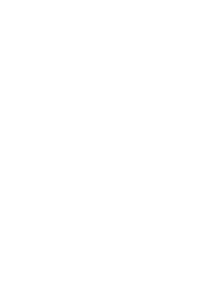

<div align="center">
  
  <br /><br />

  <a href="https://ffcfelps1.github.io/NSEE_portifolio/">
    
  </a>
  &nbsp;
  
  &nbsp;
  
</div>

<br />

# NSEE Portfolio

Portfolio website for **NSEE — Núcleo de Sistemas Eletrônicos Embarcados**, the embedded electronic systems research nucleus at **Mauá Institute of Technology (IMT)**, Brazil.

NSEE develops technological solutions in space instrumentation, AI applied to health, astrophysics, and scientific telescope software — in active partnership with ESA, DLR, GMTO, Harvard, and other international institutions.

---

## 🌐 Live Demo

**[https://nsee.github.io/NSEE_portifolio/](https://ffcfelps1.github.io/NSEE_portifolio/)**

---

## 📄 Pages

| Page | File | Description |
|------|------|-------------|
| Home | `index.html` | Hero, stats, partner strip, and overview of research areas |
| About | `about.html` | Mission, research pillars, and full historical timeline (2003–2025) |
| Team | `team.html` | Member cards with roles, bios, and links to LinkedIn & Lattes |
| Projects | `projects.html` | Project portfolio across Space, AI, Astrophysics, and GMT |
| Contact | `contact.html` | Contact form, email, and social media links |

---

## 🛠 Stack & File Structure

Pure **HTML + CSS + JavaScript** — no build step, no framework, no dependencies.

```
NSEE_portifolio/
├── index.html          # Home page
├── about.html          # About & timeline
├── team.html           # Team members
├── projects.html       # Project portfolio
├── contact.html        # Contact
├── robots.txt
├── sitemap.xml
├── css/
│   └── style.css       # All styles (dark/light theme via CSS variables)
├── js/
│   ├── i18n.js         # EN/PT translations — all copy lives here
│   └── main.js         # Theme toggle, scroll-reveal, filter logic, contact form
└── assets/
    ├── nsee_azul.svg
    ├── nsee_branco.svg
    ├── maua_azul.svg
    ├── maua_branco.svg
    ├── fundo_espaco.jpeg
    ├── Portifólio_NSEE.pdf
    └── team/           # Member photos (e.g. felipe-fazio.jpeg)
```

**Features:**
- 🌙 Dark / light theme (persisted via `localStorage`)
- 🌎 EN / PT language toggle (custom i18n, no external library)
- 📱 Fully responsive (mobile-first)
- ♿ Accessible (skip links, `aria-*` attributes, keyboard navigation)
- ⚡ Zero dependencies — works by opening `index.html` directly

---

## 🚀 Running Locally

No install required.

```bash
git clone https://github.com/ffcfelps1/NSEE_portifolio.git
cd NSEE_portifolio
```

Then open `index.html` in your browser, or use the **Live Server** extension in VS Code for hot-reload.

---

## ✏️ Contributing

### Adding a team member

1. Add their photo to `assets/team/<firstname-lastname>.jpg` (square crop recommended).
2. Add a new `<div class="member-card">` block in `team.html` following the existing pattern.
3. When their LinkedIn / Lattes URLs are available, replace `href="#"` with the real URL and remove the `disabled` class from the `<a>` tag.

### Editing text content

All copy (both EN and PT) lives in `js/i18n.js`. Edit the corresponding key in the `en` and `pt` objects. The HTML uses `data-i18n="key"` attributes — no need to touch the HTML for copy changes.

### Adding a project

1. Add the project card in the correct `<div class="project-category">` section in `projects.html`.
2. Add the EN and PT translation keys (`pX.title`, `pX.desc`, `pX.partners`, `pX.status`) to both language objects in `js/i18n.js`.

### Adding a timeline milestone

1. Add a new `<div class="timeline-item" data-tl-area="space|ai|gmt">` block in `about.html`.
2. Add the corresponding `tlYYYY.year`, `tlYYYY.title`, `tlYYYY.desc` keys to both language objects in `js/i18n.js`.

---

## 🤝 Partners

| Institution | Area |
|------------|------|
| [ESA — European Space Agency](https://www.esa.int) | Space — PLATO & EnVision missions |
| [DLR — German Aerospace Center](https://www.dlr.de) | Space — SimuCam, QEMULA, EnVision |
| [GMTO — Giant Magellan Telescope Organization](https://www.gmto.org) | Telescope software & visualisation |
| [LESIA — Paris Observatory](https://www.lesia.obspm.fr) | Space — SimuCam PLATO |
| [INAF — Italian National Institute of Astrophysics](https://www.inaf.it) | Space — SimuCam PLATO |
| [IWF — Austrian Space Research Institute](https://www.iwf.oeaw.ac.at) | Space — SimuCam PLATO |
| [FMABC — Faculty of Medicine ABC](https://www.fmabc.br) | AI applied to health |
| [ABP — Beneficência Portuguesa de São Paulo](https://www.beneficenciaportuguesasp.com.br) | AI — ECG deep learning |
| [Harvard University](https://www.harvard.edu) | AI in health research |
| [CentraleSupélec](https://www.centralesupelec.fr) | Academic exchange — Brafitec |
| [École des Mines de Saint-Étienne](https://www.mines-stetienne.fr) | Academic exchange — Brafitec & Double Degree |

---

## 📬 Contact

| Channel | Link |
|---------|------|
| ✉️ Email | [nsee@maua.br](mailto:nsee@maua.br) |
| 💼 LinkedIn | [linkedin.com/company/nsee-imt](https://www.linkedin.com/company/nsee-imt/) |
| 📸 Instagram | [@nsee.maua](https://www.instagram.com/nsee.maua) |
| 🐙 GitHub | [github.com/nsee-maua](https://github.com/nsee-maua) |

---

<div align="center">
  Made with ♥ by <strong>NSEE — Mauá Institute of Technology</strong>
  <br />
  <sub>© 2026 NSEE. All rights reserved.</sub>
</div>
